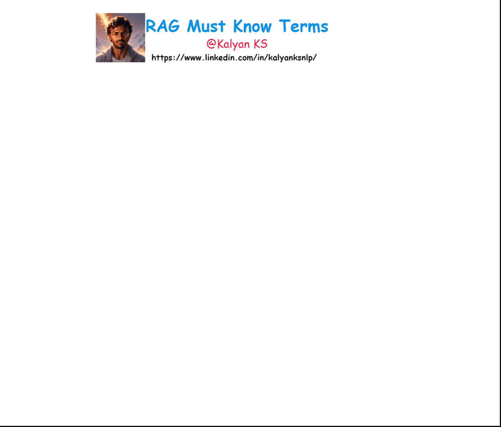

# RAG must know terms

Authored by [Kalyan KS](https://www.linkedin.com/in/kalyanksnlp/). To stay updated with LLM, RAG and Agent updates, you can follow me on [LinkedIn](https://www.linkedin.com/in/kalyanksnlp/), [Twitter](https://x.com/kalyan_kpl) and [YouTube](https://youtube.com/@kalyanksnlp?si=ZdoC0WPN9TmAOvKB).  

Here are the must know RAG terms

1. **Query**  -  The input text or question provided by a user to retrieve relevant information. It guides the retrieval and generation process in the RAG system.

2. **Chunk** – A small segment of a larger document, typically a paragraph or sentence. Chunking helps improve retrieval efficiency and relevance in RAG.

3. **Chunking** – The process of breaking down large text into smaller, meaningful segments. This ensures efficient storage, retrieval, and contextual relevance.

    

4. **Embedding** – A numerical representation of text that captures semantic meaning. It enables efficient similarity comparisons in vector spaces.

5. **Indexing** – Organizing and storing embeddings in a structured manner for fast retrieval. It helps locate relevant information efficiently in large datasets.

6. **Vector Store** – A specialized database that stores text embeddings as vectors. It enables fast and accurate similarity-based retrieval.

7. **Retrieval** – The process of fetching relevant chunks of information based on a query. It is a key step in augmenting LLMs with external knowledge.

8. **Semantic Search** – A search technique that finds results based on meaning rather than exact words. It uses embeddings to capture contextual similarities.

9. **Keyword Search** – A traditional search method that matches exact words or phrases. It does not consider semantic meaning, only textual occurrence.

10. **Hybrid Search** – A combination of keyword search and semantic search. It balances precision and recall by leveraging both techniques.

11. **Augmentation** – Enhancing the input query with retrieved information before passing it to an LLM. It provides additional context to improve response quality.

12. **Context** – The surrounding information that helps an LLM generate relevant responses. In RAG, it is obtained by merging the retrieved relevant chunks.

13. **Context Window** – The maximum number of tokens an LLM can process at once.

14. **Prompt** – The formatted input given to an LLM to generate a response. It includes the user query, retrieved context, and instructions.

15. **Prompt Engineering** – The practice of designing effective prompts to guide LLM responses. It optimizes clarity, structure, and intent for better outputs.

16. **Generation** – The process where an LLM produces text based on a given prompt. It synthesizes information to generate coherent and relevant responses.

17. **Large Language Model (LLM)** – A neural network trained on vast text data to understand and generate human-like language. It powers RAG systems by interpreting queries and generating responses.

18. **Temperature** – A parameter that controls randomness in an LLM’s output. Higher values produce more diverse responses, while lower values make them more deterministic.

19. **Response** – The output generated by an LLM in answer to a query. It is influenced by retrieval, context, and instructions.