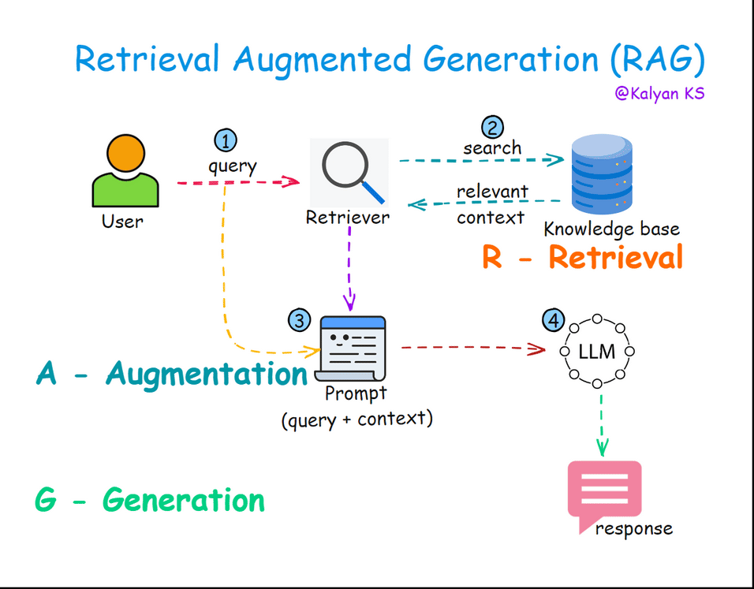

# What is RAG?
Authored by [Kalyan KS](https://www.linkedin.com/in/kalyanksnlp/). To stay updated with LLM, RAG and Agent updates, you can follow me on [LinkedIn](https://www.linkedin.com/in/kalyanksnlp/), [Twitter](https://x.com/kalyan_kpl) and [YouTube](https://youtube.com/@kalyanksnlp?si=ZdoC0WPN9TmAOvKB). 

Retrieval-Augmented Generation (RAG) is a popular technique that enhances LLM responses by retrieving relevant external knowledge from a knowledge base before generating an answer. RAG improves accuracy, reduces hallucinations, and allows the model to provide more contextually relevant and up-to-date information.

RAG involves three steps namely: Retrieval, Augmentation and Generation.

**Retrieval -** In this step, the system searches an external knowledge source, such as a vector database  to find relevant information based on the user query. 

**Augmentation -** The retrieved information is then combined with the original user query to get the LLM prompt. 

**Generation -** The LLM processes the prompt and generates a response, integrating both its pre-trained knowledge and the retrieved information. This results in more accurate and contextually relevant responses.

Let us understand RAG with a simple example.

    

**1 -** User asks a query

Example: *Who is the winner of ICC Champions Trophy 2025?*

**2 -** Retriever searches in a knowledge source (e.g., Wikipedia or Internet) and returns relevant context.

Example retrieved context: *"*The ICC Champions Trophy 2025, held from February 19 to March 9 across Pakistan and the United Arab Emirates, concluded with India emerging as the victorious champions, securing their third title in the tournament's history. Hosted primarily by Pakistan—their first global cricket event since 1996—the tournament saw a hybrid model implemented, with India playing all their matches in Dubai due to geopolitical considerations. The final, a gripping contest at the Dubai International Cricket Stadium, saw India defeat New Zealand by four wickets, chasing down a target of 252 with an over to spare. ”.

**3 -** The query, relevant context, and instructions are combined into a prompt.

Example prompt:

*"Answer the query based on the context only. If you don’t find the answer to the query  in the context, replay as - I’m unable to answer the query.* 

*Query: Who is the winner of ICC Champions Trophy 2025?*

*Context:* The ICC Champions Trophy 2025, held from February 19 to March 9 across Pakistan and the United Arab Emirates, concluded with India emerging as the victorious champions, securing their third title in the tournament's history. Hosted primarily by Pakistan—their first global cricket event since 1996—the tournament saw a hybrid model implemented, with India playing all their matches in Dubai due to geopolitical considerations. The final, a gripping contest at the Dubai International Cricket Stadium, saw India defeat New Zealand by four wickets, chasing down a target of 252 with an over to spare. “

**4 -** The prompt is fed to a Large Language Model (LLM), which generates answer for the user query based on the provided context.

Example output: *"India won the ICC Champions Trophy 2025, defeating New Zealand in the final by four wickets at the Dubai International Cricket Stadium"*

# RAG Applications

**AI Search Engines**

AI Search Engines use RAG to enhance search results by combining large language models with real-time data retrieval, providing accurate and contextually relevant answers. They excel at understanding natural language queries and pulling information from vast datasets, making searches more intuitive and efficient.

**Customer Support Chatbots**

Customer Support Chatbots leverage RAG to deliver personalized, accurate responses by retrieving company-specific data, such as FAQs or product manuals, and generating human-like replies. This reduces response times, improves customer satisfaction, and handles complex inquiries beyond simple scripted answers.

**Legal Document Analysis**

Legal Document Analysis employs RAG to sift through extensive legal texts, contracts, or case law, retrieving relevant clauses or precedents and summarizing them in plain language. It aids lawyers by accelerating research, ensuring accuracy, and identifying critical insights from dense documentation.

**Scientific Research Assistance**

Scientific Research Assistance uses RAG to assist researchers by retrieving and synthesizing information from scientific papers, datasets, or experiments, offering concise summaries or hypotheses. It streamlines literature reviews, fact-checking, and exploration of complex topics across vast research repositories.

**Healthcare Decision Support**

Healthcare Decision Support integrates RAG to pull patient data, medical literature, or treatment guidelines, assisting doctors with evidence-based recommendations or diagnoses. It enhances decision-making by providing up-to-date, context-specific insights while prioritizing patient confidentiality and accuracy.

**Personalized Education**

Personalized Education applies RAG to tailor learning experiences, retrieving relevant educational content and generating explanations suited to a student’s pace and comprehension level. It supports tutors or self-learners by adapting to individual needs and filling knowledge gaps effectively.

**Technical Documentation Search**

Technical Documentation Search utilizes RAG to navigate complex manuals, codebases, or troubleshooting guides, retrieving precise solutions and explaining them clearly. It saves time for developers and engineers by quickly addressing technical queries with context-aware, detailed responses.