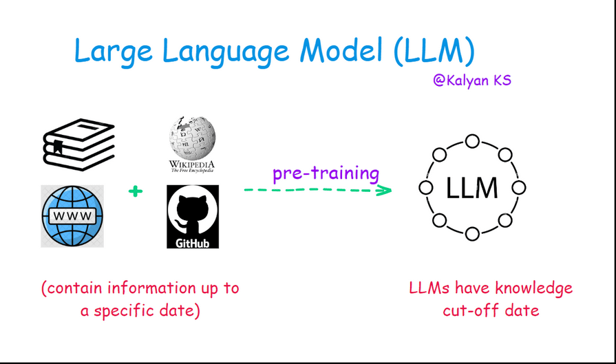
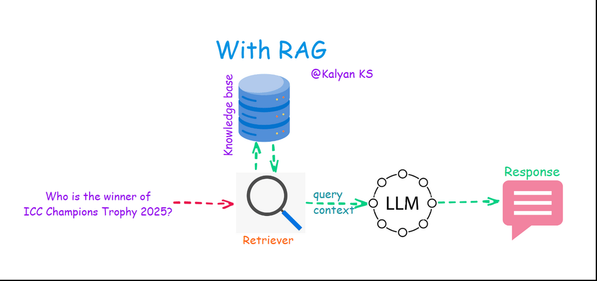

# Why RAG?

Authored by [Kalyan KS](https://www.linkedin.com/in/kalyanksnlp/). To stay updated with LLM, RAG and Agent updates, you can follow me on [LinkedIn](https://www.linkedin.com/in/kalyanksnlp/), [Twitter](https://x.com/kalyan_kpl) and [YouTube](https://youtube.com/@kalyanksnlp?si=ZdoC0WPN9TmAOvKB). 

LLMs are typically trained on vast datasets comprising text from books, Wikipedia, websites, and code from Github repositories. This training data is collected up to a specific date, meaning that an LLM’s knowledge has a cutoff point tied to when the training data was last updated. For instance, if an LLM’s training data only goes up to December 2023, it lacks information about anything that happened afterward.

    

Without RAG, when users ask questions about events, developments, or information beyond that cutoff date, the LLM faces a problem: it either cannot provide an answer (leaving the query unresolved) or, worse, it might "hallucinate" by generating a plausible-sounding but incorrect response. This happens because LLMs are designed to predict and generate text based on patterns in their training data, not to inherently distinguish between what they know and what they don’t.

    

With RAG, this limitation is addressed by integrating a retrieval mechanism. When a query is posed—especially one related to recent events—retriever  fetches relevant, up-to-date context from external sources (like web data, databases, or posts on platforms like X) in real time. 

This retrieved information is then provided to the LLM as additional context, enabling it to generate an accurate and informed response based on the latest available data rather than relying solely on its static, pre-trained knowledge. In essence, RAG bridges the gap between the LLM’s fixed training cutoff and the ever-evolving world, ensuring more reliable and current answers.

    

To summarize,

LLMs are  trained on vast amounts of text from books, Wikipedia, websites, and code from GitHub repositories. However, their training data is limited to information available up to a specific date. This means their knowledge is **cut off** at that date.

### **Problem Without RAG**

- LLMs **cannot answer queries** about events or facts that occurred after their training cutoff.
- They may generate **incorrect or hallucinated responses**, making them unreliable for up-to-date information.

### **Solution With RAG**

- **Retrieves** relevant content from an external knowledge source (e.g., databases, APIs, or private documents).
- **Provides**  the retrieved relevant content as context to the LLM along with query, enabling it to generate factually accurate answers.
- Ensures the response is **grounded in retrieved information**, reducing hallucination.

Thus, RAG enhances LLMs by **keeping them updated** without requiring frequent retraining.