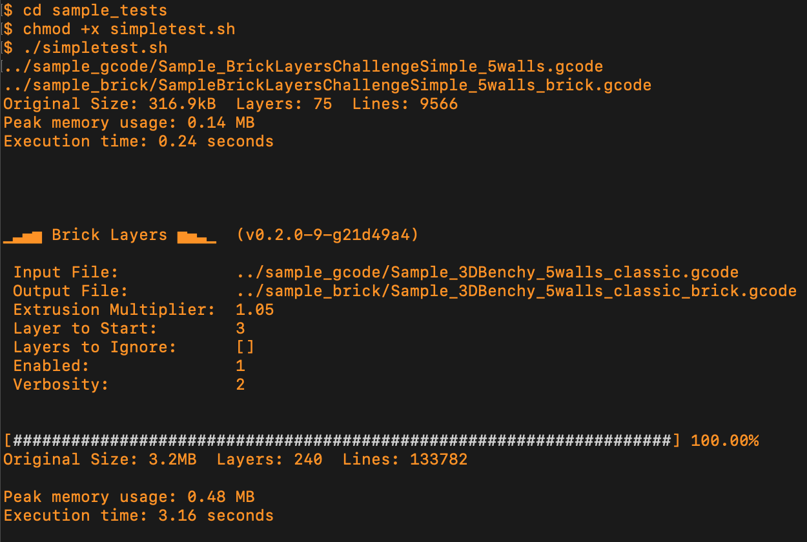

# Bricklayers
Interlocking Layers Post-Processing Script for PrusaSlicer, OrcaSlicer, and BambuStudio

## Video about this script:
[](https://www.youtube.com/watch?v=qqJOa46OTTs)

---

## Install Python or Pypy
To use the script, you need **Python** or **PyPy** (faster) installed:
[Download Python](https://www.python.org/downloads/)
[Download PyPy](https://pypy.org/download.html)

---

## Setup in your Slicer
Edit the **"Post processing scripts"** section in your slicer.

**Make sure to update the path** to match:
- Your **Python installation** folder.
- The folder where **you saved `bricklayers.py`**.

### 🖥️ **Windows Example**
```%USERPROFILE%\AppData\Local\Programs\Python\Python313\python.exe C:\3DPrinting\Scripts\bricklayers.py -startAtLayer 3 -extrusionMultiplier 1.05 -enabled 1;```

### 🍏 **Mac Example (Using PyPy)**
```/usr/local/bin/pypy3 /Volumes/3DPrinting/Scripts/bricklayers.py -startAtLayer 3 -extrusionMultiplier 1.05 -enabled 1;```

---

## Command Line Interface
You can use the script to modify GCode files outside of the slicer.
First, I recommend you to check 2 examples in this file:
https://github.com/GeekDetour/BrickLayers/blob/main/sample_tests/simpletest.sh

Try running it once, as provided.

If you downloaded or cloned the repository, in your Terminal, go to the repository and:
```sh
cd sample_tests
chmod +x simpletest.sh
./simpletest.sh
```

You should see something like this:



---

## Features
**Automatically detects Layer Height and Retraction settings**.

**Detailed instructions in the next hours. Thanks for your patience.**

