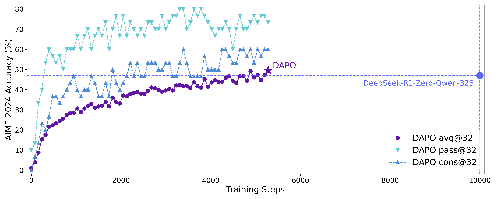
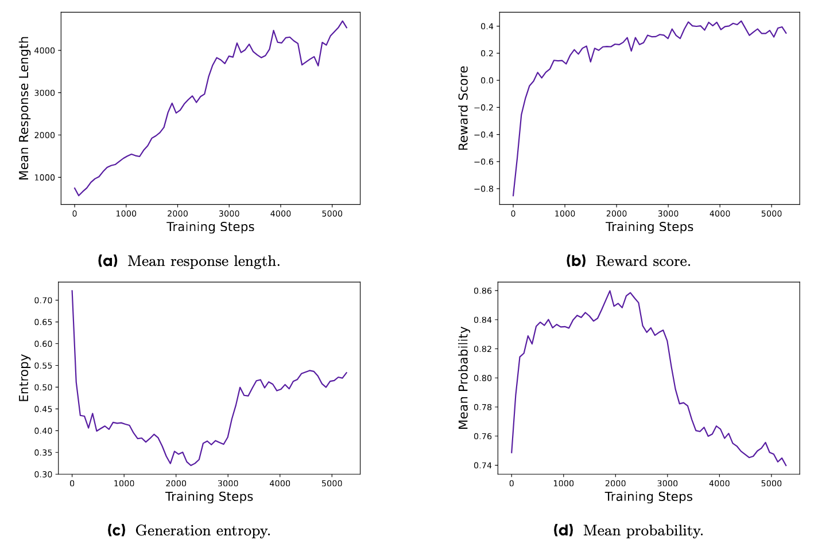

<h1>DAPO: an Open-source RL System from  ByteDance Seed and Tsinghua AIR</h1>

<!-- TODO:  Thread,Paper,Dataset,Weights-->

[-63cad3?style=for-the-badge&logo=huggingface&logoColor=white)](https://github.com/BytedTsinghua-SIA/DAPO)
<!--  -->

We release a fully open-sourced system for large-scale LLM RL, including algorithm, code infrastructure, and dataset. The system achieves state-of-the-art large-scale LLM RL performance. We propose the **D**ecoupled Clip and **D**ynamic s**A**mpling **P**olicy **O**ptimization (**DAPO**) algorithm.
Through open-sourcing, we provide the broader research community and society with practical access to scalable reinforcement learning, enabling all to benefit from these advancements. Our system is based on the awesome [verl](https://github.com/volcengine/verl) framework. Thanks for their great work!

## Key Results

### AIME 2024 Performance

**DAPO** achieves 50 points on AIME 2024 based on the Qwen2.5-32B base model, outperforming the previous SoTA DeepSeek-R1-Zero-Qwen-32B with 50% training steps.

### Metric Supervision during Training

1. **Length stability and growth**: The steady increase in response length allows for greater exploration, facilitating the model’s ability to learn more complex reasoning behaviors, ultimately contributing to training stability and performance improvement.

2. **Reward score stability**: A stable increase in the reward signal indicates that the model is successfully fitting the training distribution, ensuring that the learning process remains robust and consistent without significant fluctuations.

3. **Entropy and mean probability trend**: A controlled increase in entropy, after an initial decrease, ensures a healthy balance between exploration and exploitation, avoiding issues such as overfitting or excessive randomness, and promoting sustained model performance.

## Reproducibility

To benefit the broader research community, we fully open-source the recipe of our RL training, including algorithm details, dataset, and infrastructures.

### Datasets
We provide training and validation datasets for DAPO training.

Training: [DAPO-Math-17k](https://huggingface.co/datasets/BytedTsinghua-SIA/DAPO-Math-17k), a carefully curated and processed math dataset.
Validation: [AIME 2024](https://huggingface.co/datasets/BytedTsinghua-SIA/AIME-2024).

### Training

We provide the [out-of-the-box](https://github.com/volcengine/verl/blob/gm-tyx/puffin/main/recipe/dapo/run_dapo_qwen2.5_32b.sh) script for DAPO training reproduction.

Note:

- The current script does not include the `Dynamic Sampling` feature and achieves 44 points on AIME.

- The detailed wandb log will be provided and we are working on cleaning some weired logs. 

- The performance of Figure 1 in the paper (50 on AIME) is achieved using the full DAPO algorithm based on our internal infrastructure, which includes heavy engineering optimization code based on verl. We are working on cleaning the code and releasing the full version soon. Please stay tuned!

## Acknowledgement

We thank the [verl](https://github.com/volcengine/verl) for providing the awesome open-source RL infrastructure.

Our open-sourced experiments were conducted on the Volcano Engine Machine Learning Platform. We will provide a full reproduction guideline later on the Volcano Engine platform to help users replicate our experiments.

<!-- ## Citation -->
