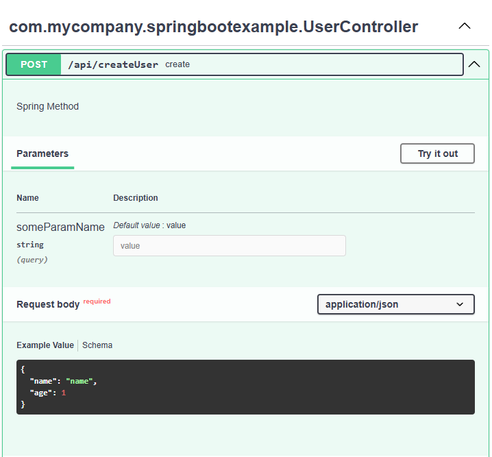
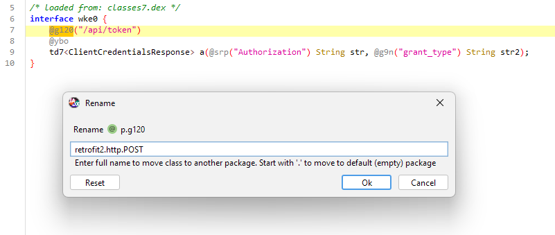

## BFScan

Tool for initial processing of APK / XAPK / DEX / JAR / WAR applications.

* Search for strings in source code and resources that look like URIs, paths, or secrets
* Generate raw HTTP requests and OpenAPI specifications based on config files, class and method annotations
	* Supported client libraries
		* [Square Retrofit](https://square.github.io/retrofit/)
		* [Ktorfit](https://foso.github.io/Ktorfit/)
		* [Feign](https://github.com/OpenFeign/feign)
	* Supported server libraries
		* [Spring Web Annotations](https://docs.spring.io/spring-framework/docs/current/javadoc-api/org/springframework/web/bind/annotation/package-summary.html)
		* [JAX-RS](https://docs.oracle.com/javaee/7/api/javax/ws/rs/package-summary.html), [Jakarta RESTful Web Services](https://jakarta.ee/learn/specification-guides/restful-web-services-explained/)
		* [JAX](https://docs.oracle.com/javaee/7/api/javax/servlet/annotation/package-summary.html), [Jakarta Servlet Annotations](https://jakarta.ee/specifications/platform/9/apidocs/jakarta/servlet/annotation/package-summary)
		* [Micronaut](https://docs.micronaut.io/latest/guide/#httpServer)
		* [web.xml Servlets](https://docs.oracle.com/cd/E24329_01/web.1211/e21049/web_xml.htm)
		* [jetty.xml Servlets](https://jetty.org/docs/jetty/12/programming-guide/server/http.html)
		* [Struts 1](https://weblegacy.github.io/struts1/) & [Struts 2 Actions](https://struts.apache.org/getting-started/coding-actions)
		* [Swagger](https://docs.swagger.io/swagger-core/v1.5.0/apidocs/) & [OpenApi Annotations](https://docs.swagger.io/swagger-core/v2.2.28/apidocs/)

### Usage

```text
java -jar bfscan.jar <jar_war_apk> <...> [-m <mode>] [-ma <minifiedAnnotationsSupport>] [-r <mappingFile>] [-s <searchString>] [-u <url>] [-v <verbose>]

 -m <mode>                          Mode ([a]ll, [s]ecrets, [h]ttp), default: all
 -ma <minifiedAnnotationsSupport>   Minified or unknown annotations support (yes, no), default: yes
 -r <mappingFile>                   Deobfuscation mapping file
 -s <searchString>                  Search string
 -u <url>                           API base url (http://localhost/api/)
 -v <verbose>                       Log level (off, error, warn, info, debug, trace)
```

```text
java -jar bfscan.jar test/*.apk -u https://example.tld/api/
```

### Example

For this class using Spring annotations, the following results will be generated.
```java
@RestController
@RequestMapping("/api")
public class UserController {

    @PostMapping("createUser")
    public String create(@RequestParam Optional<String> someParamName, @RequestBody User user) {
        return "response";
    }
```

#### Results

**Method**: com.mycompany.springbootexample.UserController->create

* Spring Method
```
POST /api/createUser?someParamName=value HTTP/1.1
Host: localhost
Connection: close
Content-Type: application/json

{
  "name": "name",
  "age": 1
}
```



### Obfuscated code

If you are analyzing an application that uses a supported library, but its code is obfuscated, you can create a mapping file to replace the class names.

To do this, you can manually use the "Rename" function in the decompiled code in the [jadx-gui](https://github.com/skylot/jadx), and then save the generated mapping file (File > Save mappings). Or use an [example mapping file](./assets/mapping_example.txt) for Retrofit and modify it according to your application.



Example of analyzing an application with renaming classes using a mapping file.
```
java -jar BFScan.jar ./tests/example.apk -r ./tests/mapping.txt
```

### Acknowledgements
This project uses:
- [jadx](https://github.com/skylot/jadx) - Apache License 2.0