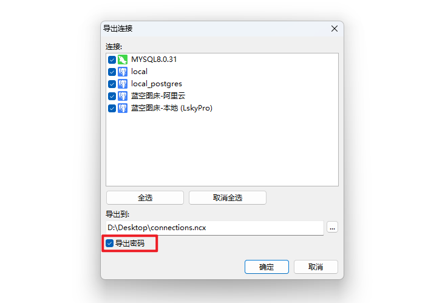
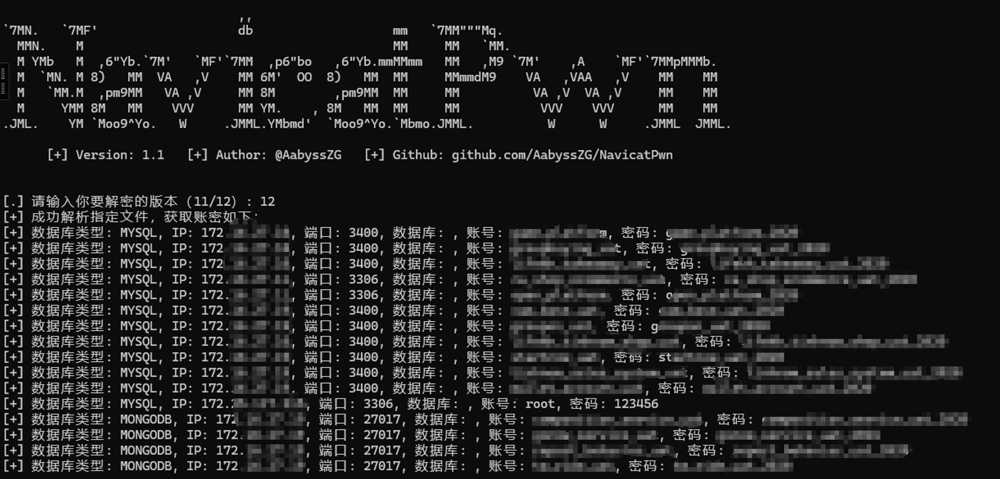

## ✈️ 一、工具概述

内网渗透实战场景下，任何可以被利用的基础设施都要关注到，才能在多维度对内网进行“降维打击”，获取 Navicat Premium 保存的数据库账密也是关键的一步

[Navicat Premium](https://www.navicat.com)是运维人员非常喜欢用的数据库管理工具之一，能够连接查看内外网的各种主流数据库（MySQL/PostgreSQL/Oracle/SQLite/SQL Server/MongoDB等等）


其实在内网渗透过程中，也会在目标内网找到相关机器安装了该工具，这个时候我们应该如何提取Navicat保存的数据库账号密码呢?

## 📝 二、TODO

* [x] 读取系统注册表，自动从注册表提取并解密 Navicat Premium 保存的数据库账密
* [x] 读取 Navicat Premium 导出的连接 `.ncx` 文件，自动解密里面保存的数据库账号密码
* [x] 解密指定的 Navicat Premium 保存的密码，支持Navicat版本V11和Navicat版本V12后的解密

## 🚨 三、安装Python依赖库

```
pip install -r requirements.txt
```

如果pip安装速度慢，可以采用国内源进行安装：

```
pip install -r requirements.txt -i https://pypi.tuna.tsinghua.edu.cn/simple/
```

## 🐉 四、工具使用

### 4.1 读取并自动解密 Navicat 导出的连接

当你忘记 Navicat Premium 保存的数据库账密，或进入内网运维人员的机器时看到机器上面有 Navicat Premium 并保存了连接，可以如下导出连接：


勾选上导出密码，即可导出为 `.ncx` 文件：



将该 `.ncx` 文件传输回来，使用本工具：

```
python3 NavicatPwn.py -f connections.ncx
```



### 4.2 读取系统注册表保存的 Navicat 数据库账密

内网渗透很多情况下，并没有RDP或者其他远程桌面的权限，如何通过命令行导出 Navicat Premium 保存的数据库账密呢？

可以尝试命令行读取以下注册表内容，查看是否存有 Navicat 的相关注册表信息：

```
C:\Users\demo>reg query HKEY_CURRENT_USER\Software\PremiumSoft

HKEY_CURRENT_USER\Software\PremiumSoft\Navicat
HKEY_CURRENT_USER\Software\PremiumSoft\NavicatMARIADB
HKEY_CURRENT_USER\Software\PremiumSoft\NavicatMONGODB
HKEY_CURRENT_USER\Software\PremiumSoft\NavicatMSSQL
HKEY_CURRENT_USER\Software\PremiumSoft\NavicatORA
HKEY_CURRENT_USER\Software\PremiumSoft\NavicatPG
HKEY_CURRENT_USER\Software\PremiumSoft\NavicatPremium
HKEY_CURRENT_USER\Software\PremiumSoft\NavicatSQLite
```

如果存在这样的结果，说明 Navicat Premium 将相关配置存在注册表当中，可以直接使用本工具：

```
python3 NavicatPwn.py --reg
```


### 4.3 读取原始密码并解密

如果查不到注册表信息，那可以尝试查看以下文件路径：

```
C:\Users\你的用户名\AppData\Roaming\PremiumSoft\Navicat\Navicat Premium\servers.json
C:\Users\你的用户名\AppData\Roaming\PremiumSoft\Navicat\Navicat Premium\connections.json
C:\Users\你的用户名\AppData\Roaming\PremiumSoft\Navicat\Navicat Premium\navicat.db
```

里面包含了 Navicat Premium 保存的数据库账密，但是是加密后的密码，可以使用以下命令手动解密：

```
python3 NavicatPwn.py -p 15057D7BA390
```

后续如果有批量解密的需求，也可以找我看看哈哈

### 4.4 Release

已经在Release上传打包好的exe，查杀也不是很敏感，师傅们可以放心用：[https://github.com/AabyssZG/NavicatPwn/releases](https://github.com/AabyssZG/NavicatPwn/releases)


**如果想要修改和使用本项目，请自行查看代码并保证遵守免责声明！**

## 🖐 五、免责声明

1. 如果您下载、安装、使用、修改本工具及相关代码，即表明您信任本工具
2. 在使用本工具时造成对您自己或他人任何形式的损失和伤害，我们不承担任何责任
3. 如您在使用本工具的过程中存在任何非法行为，您需自行承担相应后果，我们将不承担任何法律及连带责任
4. 请您务必审慎阅读、充分理解各条款内容，特别是免除或者限制责任的条款，并选择接受或不接受
5. 除非您已阅读并接受本协议所有条款，否则您无权下载、安装或使用本工具
6. **您的下载、安装、使用等行为即视为您已阅读并同意上述协议的约束**
